# TaskFlow


Aplicación web de gestión de tareas personales con un módulo de análisis de
datos. Construida enteramente en Python: FastAPI en el servidor, Jinja2 con
HTMX en la interfaz, pandas para el análisis y MongoDB como única base de datos.

No hay JavaScript propio más allá del canal de eventos: la interactividad la
resuelve HTMX pidiendo fragmentos de HTML al servidor.

## Demo en vivo

**Aplicación:** [taskflow-812302804238.us-central1.run.app](https://taskflow-812302804238.us-central1.run.app/)

## Funcionalidades

**Cuentas**
- Registro e ingreso con contraseñas hasheadas
- Sesión con inactividad deslizante de 30 minutos y duración máxima de 12 horas
- Cada usuario ve únicamente lo suyo: la pertenencia se verifica en la consulta

**Tareas**
- Crear, completar, filtrar, buscar y eliminar
- Categorías, prioridades y fechas límite

**Analítica de tareas**
- Cumplimiento, tiempo medio de cierre y tareas vencidas
- Serie semanal de creadas frente a completadas
- Distribución por estado, prioridad y categoría
- Filtros por rango de fechas, categoría y prioridad que recalculan sin recargar

**Análisis de archivos**
- Carga de CSV, Excel y JSON
- Perfilado automático: tipos, nulos, valores únicos y estadísticas descriptivas
- Explorador de gráficos con siete tipos y cinco funciones de agregación
- Vista previa de las primeras filas

**Tiempo real**
- Los indicadores se actualizan solos cuando cambia algo, sin recargar

## Stack

| Capa | Tecnología |
|---|---|
| Servidor y API | FastAPI, Uvicorn |
| Interfaz | Jinja2, HTMX, Tailwind CSS |
| Tiempo real | Server-Sent Events |
| Base de datos | MongoDB, con GridFS para archivos |
| Análisis | pandas |
| Formato interno | Parquet |
| Gráficos | Plotly, renderizado en el servidor |
| Sesiones | JWT en cookie httponly |
| Contraseñas | bcrypt con pimiento |

## Conexiones externas

| Servicio | Uso | Obligatorio |
|---|---|---|
| MongoDB | Persistencia y almacenamiento de archivos | Sí |

No requiere ningún otro servicio, cuenta ni clave de API.

## Diagrama de Arquitectura

```mermaid
flowchart TB

    subgraph Clientes["👤 Cliente"]
        Browser["🌐 Navegador Web<br/>Jinja2 + HTMX + Tailwind CSS"]
    end

    subgraph CloudRun["☁️ Google Cloud Run"]
        subgraph Backend["Backend — FastAPI + Uvicorn"]
            Main["main.py<br/>Punto de entrada · middleware · barrido periódico"]
            
            subgraph Routers["Routers"]
                ApiRouter["routers/api.py<br/>API REST"]
                WebRouter["routers/web.py<br/>Páginas de tareas y analítica"]
                DatasetsRouter["routers/datasets.py<br/>Módulo de análisis de archivos"]
                EventosRouter["routers/eventos.py<br/>Canal SSE"]
            end

            subgraph Domain["Lógica de negocio"]
                Repository["repositorio.py<br/>Acceso a datos de tareas"]
                Analytics["analitica.py<br/>Cálculos con pandas"]
                Datos["datos.py<br/>Carga · perfilado · almacenamiento"]
                Graficos["graficos.py<br/>Construcción de gráficos (Plotly)"]
                Eventos["eventos.py<br/>Canal de eventos en vivo"]
                Comandos["comandos/<br/>Generador de datos de ejemplo"]
            end

            subgraph Seguridad["Seguridad"]
                Security["security.py<br/>JWT · bcrypt + pimiento"]
                Dependencias["dependencias.py<br/>Identificación del usuario"]
            end

            subgraph Config["Configuración"]
                ConfigFile["config.py<br/>Carga del .env y límites"]
                Database["database.py<br/>Conexión · índices · GridFS"]
            end

            subgraph Presentacion["Presentación"]
                Templates["templates/<br/>Plantillas Jinja2"]
                Static["static/<br/>Hoja de estilos"]
            end
        end
    end

    subgraph MongoDB["🗄️ MongoDB"]
        DB[("Base de datos<br/>Tareas · Usuarios<br/>Archivos (GridFS)")]
    end

    subgraph Almacenamiento["📁 Almacenamiento interno"]
        Parquet["Formato Parquet<br/>Datos procesados"]
    end

    %% ---- Flujo de datos ----
    Browser -->|HTTPS| Main
    Main --> ApiRouter
    Main --> WebRouter
    Main --> DatasetsRouter
    Main --> EventosRouter
    WebRouter --> Templates
    WebRouter --> Static
    ApiRouter --> Repository
    WebRouter --> Repository
    DatasetsRouter --> Datos
    DatasetsRouter --> Analytics
    DatasetsRouter --> Graficos
    EventosRouter --> Eventos
    Repository --> Database
    Analytics --> Parquet
    Datos --> Parquet
    Datos --> Database
    Graficos --> Templates
    Security --> Dependencias
    Dependencias --> Repository
    Database -->|PyMongo| DB
    Eventos -->|SSE| Browser

    %% ---- Colores de marca (Brand Colors) ----
    classDef fastapi fill:#009688,stroke:#004D40,stroke-width:2px,color:#FFFFFF,rx:12,ry:12;
    classDef python fill:#3572A5,stroke:#1A3A5C,stroke-width:2px,color:#FFFFFF,rx:12,ry:12;
    classDef mongodb fill:#47A248,stroke:#1B5E20,stroke-width:2px,color:#FFFFFF;
    classDef gcp fill:#4285F4,stroke:#1A4B9C,stroke-width:2px,color:#FFFFFF,rx:12,ry:12;
    classDef jinja fill:#B41717,stroke:#7F0000,stroke-width:2px,color:#FFFFFF,rx:10,ry:10;
    classDef htmx fill:#3D72D7,stroke:#1A3A6C,stroke-width:2px,color:#FFFFFF,rx:10,ry:10;
    classDef tailwind fill:#06B6D4,stroke:#0369A1,stroke-width:2px,color:#FFFFFF,rx:10,ry:10;
    classDef plotly fill:#3F4F75,stroke:#1A1F2E,stroke-width:2px,color:#FFFFFF,rx:10,ry:10;
    classDef security fill:#333333,stroke:#000000,stroke-width:2px,color:#FFFFFF,rx:10,ry:10;
    classDef neutral fill:#F5F5F5,stroke:#CCCCCC,stroke-width:1px,color:#333333,rx:10,ry:10;

    class Browser neutral;
    class Main,ApiRouter,WebRouter,DatasetsRouter,EventosRouter fastapi;
    class Repository,Analytics,Datos,Graficos,Eventos,Comandos,ConfigFile,Database python;
    class Security,Dependencias security;
    class Templates jinja;
    class Static htmx;
    class DB mongodb;
    class Parquet neutral;
    class Graficos plotly;

    %% ---- Estilos de subgráficos ----
    style Clientes fill:#FAFAFA,stroke:#DDDDDD,stroke-width:1px,rx:14,ry:14;
    style CloudRun fill:#E1F5FE,stroke:#4285F4,stroke-width:2px,stroke-dasharray:6 4,rx:16,ry:16;
    style Backend fill:#E0F2F1,stroke:#009688,stroke-width:1px,rx:12,ry:12;
    style Routers fill:#E3F2FD,stroke:#009688,stroke-width:1px,rx:10,ry:10;
    style Domain fill:#EDE7F6,stroke:#009688,stroke-width:1px,rx:10,ry:10;
    style Seguridad fill:#F5F5F5,stroke:#333333,stroke-width:1px,rx:10,ry:10;
    style Config fill:#F3E8FF,stroke:#009688,stroke-width:1px,rx:10,ry:10;
    style Presentacion fill:#FFF3E0,stroke:#009688,stroke-width:1px,rx:10,ry:10;
    style MongoDB fill:#E8F5E9,stroke:#47A248,stroke-width:2px,stroke-dasharray:6 4,rx:16,ry:16;
    style Almacenamiento fill:#F0F0F0,stroke:#CCCCCC,stroke-width:1px,stroke-dasharray:4 3,rx:14,ry:14;
```



## Estructura

```
backend/
├── requirements.txt
└── app/
    ├── main.py              Punto de entrada, middleware y barrido periódico
    ├── config.py            Carga del .env y límites
    ├── database.py          Conexión, índices y GridFS
    ├── security.py          Hasheo de contraseñas y sesiones
    ├── dependencias.py      Identificación del usuario
    ├── esquemas.py          Modelos de entrada y salida
    ├── repositorio.py       Acceso a datos de tareas
    ├── analitica.py         Cálculos sobre tareas con pandas
    ├── datos.py             Carga, perfilado y almacenamiento de archivos
    ├── graficos.py          Construcción de gráficos
    ├── eventos.py           Canal de eventos en vivo
    ├── comandos/            Generador de datos de ejemplo
    ├── routers/
    │   ├── api.py           API REST
    │   ├── web.py           Páginas de tareas y analítica
    │   ├── datasets.py      Módulo de análisis de archivos
    │   └── eventos.py       Canal SSE
    ├── templates/           Plantillas Jinja2
    └── static/              Hoja de estilos
```

## Requisitos

- Python 3.11 o superior
- Una base MongoDB accesible

## Instalación

```bash
git clone https://github.com/lariasca1994/taskflow.git
cd taskflow

python -m venv .venv
.venv\Scripts\Activate.ps1        # Windows
source .venv/bin/activate         # Linux o macOS

pip install -r backend/requirements.txt
cp .env.example .env
```

Si PowerShell bloquea la activación del entorno:

```powershell
Set-ExecutionPolicy -Scope Process -ExecutionPolicy RemoteSigned
```

### Configuración

El `.env` necesita la cadena de conexión a MongoDB y dos secretos **distintos
entre sí**. Genera cada uno por separado:

```bash
python -c "import secrets; print(secrets.token_urlsafe(48))"
```

- `JWT_SECRET` firma las sesiones
- `PASSWORD_PEPPER` se mezcla con las contraseñas antes de hashearlas

`PASSWORD_PEPPER` no debe cambiarse una vez existan cuentas: invalidaría todas
las contraseñas.

Los límites del módulo de análisis también se configuran ahí. La plantilla
indica el nombre y el propósito de cada variable.

## Ejecución

```bash
cd backend
uvicorn app.main:app --reload
```

El `cd backend` es necesario: las rutas de plantillas y archivos estáticos se
resuelven desde ahí.

| Recurso | Dirección |
|---|---|
| Aplicación | `http://127.0.0.1:8000` |
| Documentación de la API | `http://127.0.0.1:8000/docs` |
| Estado del servicio | `http://127.0.0.1:8000/api/health` |

## Datos de ejemplo

El panel de analítica necesita historia para que la serie semanal tenga forma.
Tras crear una cuenta:

```bash
cd backend
python -m app.comandos.generar_ejemplo tu@correo.com 180
```

Genera tareas repartidas en varios meses, con sesgo hacia fechas recientes y
tiempos de cierre verosímiles.

## Límites del módulo de análisis

| Concepto | Valor |
|---|---|
| Formatos | CSV, XLSX, JSON |
| Tamaño máximo | 10 MB |
| Filas máximas | 500.000 |
| Archivos por usuario | 5 |
| Caducidad | 24 h sin uso, o al cerrar sesión |

El JSON debe ser un arreglo de objetos. Las estructuras anidadas se rechazan con
un aviso: no existe una forma única de convertirlas a tabla.

## Decisiones de diseño

**Parquet como formato interno.** El archivo que sube el usuario se lee una sola
vez y se guarda convertido. Parquet es columnar y comprimido, así que cargar dos
columnas cuesta milisegundos frente a releer y reinterpretar el original en cada
cambio de filtro. Es lo que hace viable un explorador interactivo.

**Los archivos viven en GridFS**, no en disco. La aplicación no depende del
sistema de archivos local, así que funciona igual en un servicio con
almacenamiento efímero.

**La agregación se hace en pandas y no en la base.** El volumen por usuario es
reducido, y trabajar sobre un DataFrame permite operaciones de series de tiempo
—remuestreo semanal, medias— que en Mongo exigirían tuberías bastante más largas
y difíciles de leer.

**Los gráficos se renderizan en el servidor** y viajan como HTML. El navegador
solo los dibuja.

**Server-Sent Events y no WebSockets.** El flujo va en un solo sentido y SSE
reconecta por su cuenta. Además, `EventSource` no admite cabeceras propias, de
modo que la autenticación viaja necesariamente en la cookie de sesión: es la
razón por la que la sesión se guarda así y no en almacenamiento del navegador.

**Doble caducidad de los archivos.** Se borran al cerrar sesión, pero casi nadie
pulsa "Salir": un barrido horario elimina los que lleven 24 horas sin uso, para
que nada quede huérfano.

## Seguridad

### Contraseñas

Se **hashean**, no se cifran. El cifrado es reversible: en una filtración
bastaría la clave para recuperarlas en claro. El hash es de una sola vía.

Tres capas:

| Capa | Qué aporta |
|---|---|
| Pimiento (HMAC-SHA256) | Un secreto que vive en la configuración, no en la base. Sin él, un volcado robado no sirve ni para probar contraseñas comunes |
| bcrypt con sal única | Dos usuarios con la misma contraseña producen hashes distintos |
| Coste 12 | Cada verificación cuesta unos 250 ms: irrelevante para el usuario, prohibitivo para la fuerza bruta |

El pimiento resuelve además el límite de 72 bytes de bcrypt, que trunca en
silencio las contraseñas más largas: el HMAC produce siempre una entrada de
longitud fija.

Las cuentas creadas con un esquema anterior se actualizan solas en el siguiente
ingreso, sin obligar a nadie a restablecer su contraseña.

### Resto

- Sesión en cookie `httponly`: JavaScript no puede leer el token
- Inactividad deslizante de 30 minutos y expiración absoluta de 12 horas
- Pertenencia verificada en el filtro de la consulta, no en la vista
- Validación de archivos por extensión, tamaño y número de filas
- Formatos que ejecutan código al deserializar, como pickle, rechazados
- Cuota de archivos por cuenta
- Búsquedas con la entrada escapada antes de construir la expresión regular
- Cabeceras `X-Content-Type-Options`, `X-Frame-Options` y `Referrer-Policy`

## Limitación conocida

El registro de suscriptores del canal de eventos vive en memoria del proceso.
Con un único proceso de Uvicorn funciona correctamente; con varios trabajadores,
un evento generado en uno no alcanzaría a los clientes conectados a otro. La
solución sería un intermediario como Redis, descartado para no añadir una
dependencia externa a un proyecto que debe levantarse con un solo comando.

## Despliegue

La aplicación corre en Google Cloud Run, con MongoDB Atlas M0 (plan gratuito)
como base de datos.

## Autor

**Luis Felipe Arias Carriazo**
[GitHub](https://github.com/lariasca1994) · [LinkedIn](https://linkedin.com/in/lfac1)

## Licencia

MIT